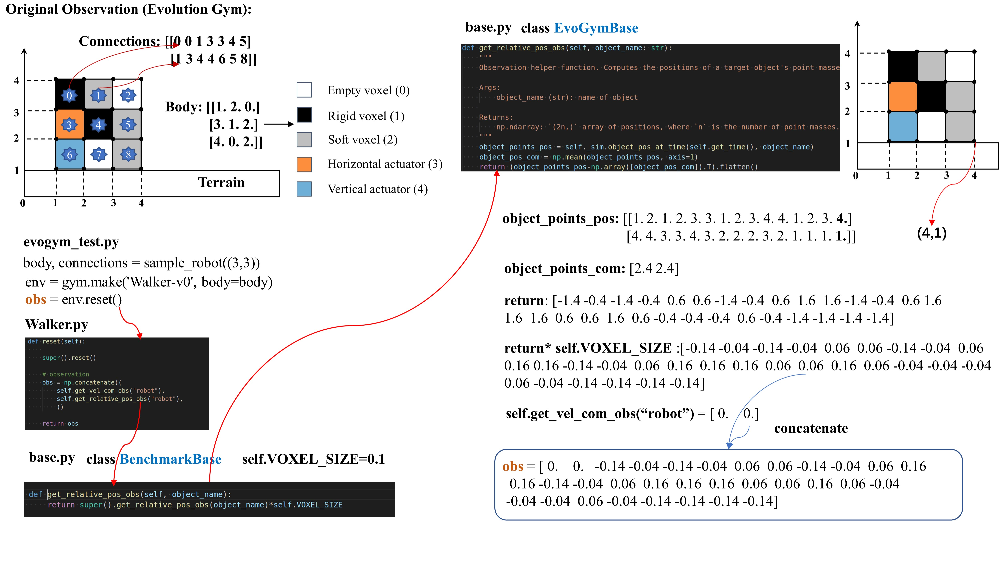

# ModularEvoGym
This is a modified benchmark which provides a modular soft robot design space and a modular state-action space for designing and controlling 2D Voxel-based Soft Robots (VSRs). ModularEvoGym is based on [EvolutionGym](https://github.com/EvolutionGym/evogym)

**New features**:

Design (optional):
A modular design space for VSRs which can be incorporated into the Reinforcement Learning process.
A designer (design policy network) based on Neural Cellular Automata (NCA).

Control:
A modular state-action space for VSRs.
A universal Transformer-based controller (control policy network) which can be trained by PPO（Proximal Policy Optimization).

## 1. Original Observation of EvolutionGym

