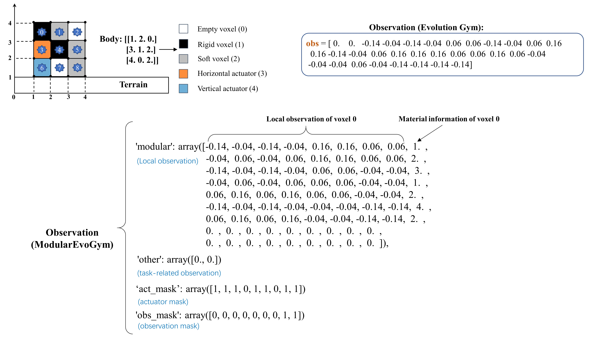
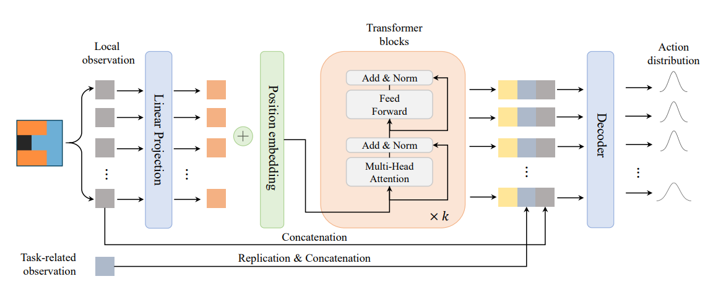
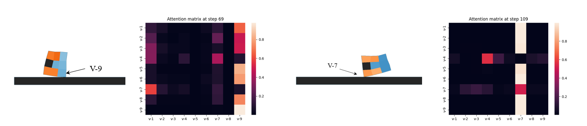

# ModularEvoGym (Continuous updating)
This is a modified benchmark that provides a modular soft robot design space and a modular state-action space for designing and controlling 2D Voxel-based Soft Robots (VSRs). ModularEvoGym is based on [EvolutionGym.](https://github.com/EvolutionGym/evogym)


## New features

<font color=Blue>Design (optional):</font>

1. A modular design space for VSRs which can be incorporated into the Reinforcement Learning process.

2. A universal **Designer** (design policy network) based on Neural Cellular Automata (NCA).

<font color=Blue>Control:</font>

1. A modular state-action space for VSRs.

2. A universal Transformer-based **Controller** (control policy network) which can be trained by Proximal Policy Optimization (PPO).

## Observation Space


**Observation Space of ModularEvoGym**


The input state of the robot at time step $t$ is represented as $s_{t}^{c}=\lbrace s_{t}^{v},s_{t}^{g}\rbrace$, where $s_{t}^{v}=\lbrace s_{t}^{v_{1}}, s_{t}^{v_{2}},...,s_{t}^{v_N}\rbrace$, $s_{t}^{v_i}$ is composed of each voxel's local information which contains the relative position of its four corners with respect to the center of mass of the robot and its material information (e.g., <b><font color=Gray>soft voxel</font></b>, <b>rigid voxel</b>, <b><font color=Darkorange>horizontal actuator</font></b> and <b><font color=DeepSkyBlue>vertical actuator</font></b>). $s_{t}^{g}$ is the task-related observation such as terrain information of the environment and goal-relevant information. During the simulation, voxels (except empty voxels) only sense locally, and based on the input sensory information, a controller outputs control signals to vary the volume of actuator voxels. The morphology of the robot is unchangeable during the interaction with the environment.

## Installation
Clone:

```shell
git clone https://github.com/Yuxing-Wang-THU/ModularEvoGym.git
```
### Requirements

* Python 3.7/3.8
* Linux, macOS, or Windows with [Visual Studios 2017](https://visualstudio.microsoft.com/vs/older-downloads/)
* [OpenGL](https://www.opengl.org//)
* [CMake](https://cmake.org/download/)
* [PyTorch](http://pytorch.org/)

<!--- (See [installation instructions](#opengl-installation-on-unix-based-systems) on Unix based systems) --->

On **Linux**:

```shell
sudo apt-get install xorg-dev libglu1-mesa-dev
```

Install Python dependencies with conda:

```shell
conda env create -f environment.yml
```
### Build and Install Package

To build the C++ simulation, build all the submodules, and install `evogym` run the following command:

```shell
python setup.py install
``` 

### Test Installation

cd to the `examples` folder and run the following script:

```shell
python gym_test.py
```
gym_test.py
```python
import gym
import modularevogym.envs
from modularevogym import sample_robot
import numpy as np

if __name__ == '__main__':
    mode = "modular"
    body_size = (3,3)
    body, connections = sample_robot(body_size)
    # If you want to use the original EvolutionGym, just remove the "mode" option 
    env = gym.make('Walker-v0', body=body, mode=mode)
    obs = env.reset()

    while True:
        if mode == 'modular':
            action = np.random.uniform(low=0.6, high=1.6, size=body_size[0]*body_size[1])-1
        else:
            action = env.action_space.sample()-1
        ob, reward, done, info = env.step(action)
        if done:
            break

    env.close()
```
## Controlling VSRs via Transformer
We provide a universal Transformer-based controller which can handle the incompatible state-action spaces. This controller can be trained by many popular Reinforcement Learning methods (e.g., SAC, PPO, DDPG).

### **Controller**



Self-attention brings better interpretability than multilayer perceptron. We use only one transformer encoder layer, thus, we visualize the attention matrix after the input state passes through the attention layer. The following figure shows attention matrices of 2 control steps produced by the policy network. 



The color of each attention score tells the strength of the compatibility between inputs and interprets what is driving the behaviour of the VSR. When the robot’s front foot (voxel 9) or the rear foot (voxel 7) touches the ground, the corresponding voxels are assigned with greater wights, which is consistent with humans’ intuition and common sense.

### **RL Training**

## References

[1] Jagdeep Bhatia, Holly Jackson, Yunsheng Tian, Jie Xu, and Wojciech Matusik. Evolution gym: A large-scale benchmark for evolving soft robots. In NeurIPS, 2021.

[2] Agrim Gupta, Linxi (Jim) Fan, Surya Ganguli, and Li Fei-Fei. Metamorph: Learning universal controllers with transformers. ArXiv, abs/2203.11931, 2022.

[3] Vitaly Kurin, Maximilian Igl, Tim Rocktaschel, Wendelin Boehmer, and Shimon Whiteson. My body is a cage: the role of morphology in graph-based incompatible control. ArXiv, abs/2010.01856, 2021.
