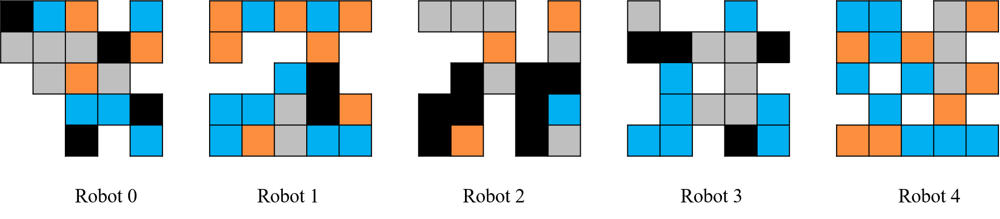
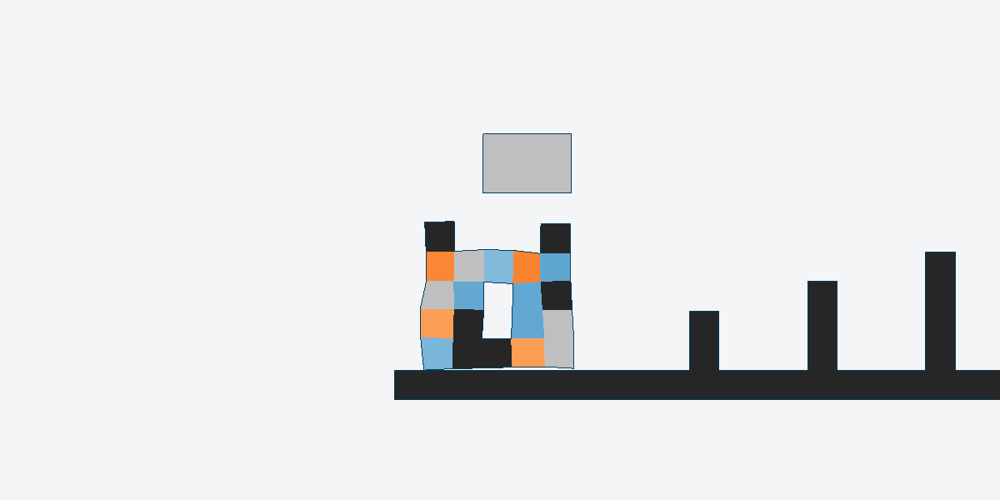

# **ModularEvoGym**
Note: A new version will be updated soon!

A modified benchmark for designing and controlling 2D Voxel-based Soft Robots (VSRs)


## **New features**
ModularEvoGym is compatible with [Evolution Gym](https://github.com/EvolutionGym/evogym) but provides some new features.

**Design**:

1. A modular robot design space.

2. We incorporate the design process into the environment and provide a universal design policy based on a simple [Neural Cellular Automata (NCA)](https://distill.pub/2020/growing-ca/), which takes multiple actions to grow a robot from an initial morphology. NCA encodes complex patterns in a neural network and generates different developmental outcomes while using a small set of trainable parameters.

**Control**:

1. A modular robot state-action space.

2. A generalizable control policy based on [Transformer](https://en.wikipedia.org/wiki/Transformer_(machine_learning_model)), which is capable of handling incompatible state-action spaces.

These new features make the End-to-end Brain-body Co-design of modular soft robots possible.

## **Design Space**
In ModularEvoGym, the design problem is modeled as a Markov Decision Process (MDP). Our objective is to find a universal design policy that can take in arbitrary VSRs' morphologies and output a series of actions to modify them. Typically, VSRs can be characterized as multi-cellular systems which develop from a small set of initial cells. We represent our design policy as a Neural Cellular Automata, which begins with some initial seeds and updates their states according to local rules parameterized by a multilayer perceptron, thus, NCA is agnostic to the robot's morphological topology.


The above figure demonstrates a single design step when developing a VSR. The design space is surrounded by empty voxels, and each voxel is represented as a discrete value that corresponds to its material property (e.g., empty voxel=0, rigid voxel=1, soft voxel=2, horizontal actuator=3 and vertical actuator=4). The state vector $s^{d_i}$ for each voxel is composed of its type and the types of its neighborhood (e.g., Neumann or Moore neighborhood). Practically, let $N$ be the size of the design space, the MDP state of a design step is represented by $s_{t}^{d}=\{s_{t}^{d_{1}},s_{t}^{d_{2}},...,s_{t}^{d_N}\}$. Here, the design policy $\pi_{\theta_{D}}(a_{t}^{d}|s_{t}^{d})$ is a multilayer perceptron parameterized by $\theta_{D}$, which maps $s_{t}^{d}$ to a categorical action distribution created by the output logits. The dimension of the input layer corresponds to the number of a cell's neighbors (e.g, $9$), and the dimension of the output layer corresponds to the total number of material types (e.g, $5$). During training, the new cell state is determined by sampling from the distribution. While evaluating, the design policy selects the action that corresponds to the highest logit value.

## **State-action Space**
We model the local observations of all voxels as a sequence and provide a universal Transformer-based control policy.

**Observation Space of EvoGym**


**Observation Space of ModularEvoGym**


The input state of the robot at time step $t$ is represented as $s_{t}^{c}=\lbrace s_{t}^{v},s_{t}^{g}\rbrace$, where $s_{t}^{v}=\lbrace s_{t}^{v_{1}}, s_{t}^{v_{2}},...,s_{t}^{v_N}\rbrace$, $s_{t}^{v_i}$ is composed of each voxel's local information which contains the relative position of its four corners with respect to the center of mass of the robot and its material information (e.g., <b><font color=Gray>soft voxel</font></b>, <b>rigid voxel</b>, <b><font color=Darkorange>horizontal actuator</font></b> and <b><font color=DeepSkyBlue>vertical actuator</font></b>). $s_{t}^{g}$ is the task-related observation such as terrain information of the environment and goal-relevant information. 

During the simulation, voxels (except empty voxels) only sense locally, and based on the input sensory information, a controller outputs control signals to vary the volume of actuator voxels. By default, we use **$tanh$** activation function to scale the output action to the range of $[-1.0,1.0]$. In the simulator, this action will be $+1$ and then clipped within the range of $[0.6, 1.6]$.

## **Installation**
### 1. Clone

```shell
git clone --recurse-submodules https://github.com/Yuxing-Wang-THU/ModularEvoGym.git
```
**Make sure that submodules (glfw, glew and pybind11) are successfully downloaded to "/evogym/simulator/externals"** :relaxed:

### 2. Install evogym

Requirements：
* Python 3.7/3.8
* Linux (Ubuntu)
* [OpenGL](https://www.opengl.org//)
* [CMake](https://cmake.org/download/)
* [PyTorch](http://pytorch.org/)

<!--- (See [installation instructions](#opengl-installation-on-unix-based-systems) on Unix based systems) --->

```shell
sudo apt-get install xorg-dev libglu1-mesa-dev
```

Install Python dependencies:

```shell
conda create -n modularevogym python==3.7.11

conda activate modularevogym

pip install -r requirements.txt -i https://pypi.tuna.tsinghua.edu.cn/simple/

pip install Gpy==1.10.0 -i https://pypi.tuna.tsinghua.edu.cn/simple/

pip install git+https://github.com/yunshengtian/GPyOpt.git

pip install git+https://github.com/yunshengtian/neat-python.git

```
To build the C++ simulation, build all the submodules, and install `evogym` run the following command:

```shell
python setup.py install
``` 
If you meet this error "Could NOT find GLEW (missing: GLEW_INCLUDE_DIRS GLEW_LIBRARIES)", run

```shell
sudo apt install libglew-dev
``` 

### 3. Test Installation

cd to the `examples` folder and run the following script:

```shell
python modularevogym_test.py
```
The code of `modularevogym_test.py`
```python

import gym
import evogym.envs
from evogym import sample_robot
import numpy as np
from evogym.utils import MODULAR_ENV_NAMES

if __name__ == '__main__':
    # Setting
    mode = "modular"
    body_size = (5,5)
    
    for env_name in MODULAR_ENV_NAMES:
        print("MODULAR ENV TEST: ", env_name)
        body, connections = sample_robot(body_size)
        # ModularEvoGym is compatible with EvolutionGym, if you just want to use EvoGym
        env = gym.make(env_name, body=body)
        # If you want to use ModularEvoGym, add mode='modular' and env_id=env_name
        env = gym.make(env_name, body=body, mode='modular', env_id=env_name)
        obs = env.reset()
    
        # Just Test: Update the orignal env
        new_body, new_connections = sample_robot(body_size)
        env.update(body=new_body, connections=new_connections)
        obs = env.reset()

        # Rollout
        while True:
            if mode == 'modular':
                action = np.random.uniform(low=-1.0, high=1.0, size=body_size[0]*body_size[1])
            else:
                action = env.action_space.sample()
            ob, reward, done, info = env.step(action)
            # env.render()
            if done:
                break
        env.close()
        print("Done!")
```
# **Play with ModularEvoGym** :relaxed:

## **Controlling Modular Soft Robots via Transformer**
We provide a universal Transformer-based controller which can handle incompatible state-action spaces. This controller can be trained by many popular RL methods (e.g., SAC, PPO and DDPG). 


A learnable position embedding is applied after the linear projection layer. The local observation, the output feature of the Transformer and the task-related observation are concatenated before passing them through a decoder. Here, the control policy outputs the mean $\mu$ of the continuous action, and a constant standard deviation (a fixed diagonal covariance matrix $\Sigma$) is used to create the Gaussian distribution $\pi_{\theta_{C}}(a_{t}^{c}|s_{t}^{c})=\mathcal{N}(\mu(s_{t}^{c}),\Sigma)$, or the standard deviation can also be learnable. During training, the action is randomly sampled from the distribution. While evaluating the policy, only the mean action is used for control.


### **1. Controlling a single VSR**
To optimize the control of a predefined robot, cd to the `examples` folder and run the following script:

Use self-attention 
```shell
python run_transformer_ppo.py
```

Remove self-attention 

```shell
python run_transformer_ppo.py --ac_type fc
```

All logs are stored in `examples/saved_data/`, and you can find some trained models in `examples/visual`.

To visualize the training process:

```shell
python simple_plotter.py
```


To evaluate the trained controller:

```shell
python simple_evaluate.py
```

To make a gif:

```shell
python simple_gif.py
```


**Note:** To get a smaller gif, make sure that the `gifsicle` is successfully installed on your system. You can run the following command (for Ubuntu):

```shell
sudo apt-get install -y gifsicle
```
The Transformer-based control works well with those robots with beneficial homogeneous tissue structures. When the robot is moving, we can observe that groups of voxels are expanded or compressed simultaneously, which is related to **Muscle Synergy** (more [visual results](https://yuxing-wang-thu.github.io/publication/cuco/)).

<div align=center></div>

A muscle synergy is the activation of a group of muscles to contribute to a particular movement, thus reducing the dimensionality of muscle control. A single muscle can be part of multiple muscle synergies, and a single synergy can activate various muscles. Different ways of grouping muscles into synergies can be found in this [ reference literature](https://pubmed.ncbi.nlm.nih.gov/25174281/).


Self-attention brings better interpretability than multilayer perceptron. We use only one Transformer encoder layer, thus we visualize the generated attention matrix after one input state passes through the attention layer. The above figure shows attention matrices produced by the control policy network. The color of each attention score tells the strength of the compatibility between inputs and interprets what is driving the current behaviour. When the robot's front foot (voxel $9$) or the rear foot (voxel $7$) touches the ground, the corresponding voxels are assigned with greater wights, which is consistent with humans' intuition and common sense.

### **2. Controlling multiple VSRs with a generalizable controller**
Generalization can be further enhanced by modularization, due to the success of modeling dynamic structures via self-attention. Our Transformer-based controller is able to handle incompatible state-action spaces, thus it is possible to pre-train a powerful policy.

To train some randomly generated robots to walk, cd to the `examples` folder and run the following script:

```shell
python run_transformer_ppo_multi.py
```
Example `Walker` morphologies to be controlled:



Two logs are stored in `examples/saved_data/Walker-v0` and `examples/saved_data/Pusher-v0`, respectively. 

Learning curves:


## **End-to-end Co-design of Modular Soft Robots**

A robot's ability to interact with the environment depends both on its **brain (control policy)** and **body (morphology)**, which are inherently coupled. With the help of ModularEvoGym, we can learn how to co-design a modular soft robot.


Different from the traditional expensive **bi-level** optimization methods which maintain a population of design prototypes (left in the above figure), here, we can simultaneously optimize the design and control via reinforcement learning, which is enabled by unifying the two processes into a single MDP and using our proposed NCA-based design policy and Transformer-based control policy (right in the above figure). 


Specifically, we maintain a universal design policy $\pi_{\theta_{D}}$ and a universal control policy $\pi_{\theta_{C}}$ from the beginning to the end, thus the overall policy is represented as $\pi_{\theta}=\{ \pi_{\theta_{D}}(a_{t}^{d}|s_{t}^{d},\Psi_{t}), \pi_{\theta_{C}}(a_{t}^{c}|s_{t}^{c},\Psi_{t})\}$ where $\Psi_{t}\in\{0,1\}$ is a binary value indicating whether the robot is being created or controlled, $s_{t}^{d}$ and $s_{t}^{c}$ represent the state information received at each time step of design and control, respectively. 

At the beginning of each episode, the design policy $\pi_{\theta_{D}}(a_{t}^{d}|s_{t}^{d},\Psi_{t}=0)$ performs $N_{D}$ steps to develop a robot from an initial seed, and no rewards are assigned to these steps (you can also add design-related rewards!). The resulting robot is then presented in the simulator and controlled by $\pi_{\theta_{C}}(a_{t}^{c}|s_{t}^{c},\Psi_{t}=1)$. Thus, the design policy will be informed by the future environmental rewards collected by the control policy under the designed morphology. After collecting the desired number of trajectories, the two policies are jointly updated using PPO. 

To co-design a `Thrower` robot in $5\times5$ design space, cd to the `examples` folder and run the following script:

```shell
python run_cuco.py --env Thrower-v0 --target_size 5 --rl_only --train_iters 3000 
```

Logs are stored in `examples/saved_data/Thrower-v0`.

<div align=middle></div>

Let's have a look on the robots designed by our method:


Robots designed by evolution-based methods (Genetic Algorithm & Bayesian Optimization) from Evolution Gym.



## **Curriculum Learning for Co-design**
We have shown that it is possible to co-design robots via end-to-end RL. It's really interesting, however, given a big modular design space (e.g., $7\times 7$), exploring all possible combinations is often unfeasible (there is a significant combinatorial explosion). In this [paper](https://openreview.net/forum?id=r9fX833CsuN), we try to co-design VSRs from easy to difficult. The key to our approach is to expand this design space from a small size to the target size gradually through a predefined curriculum, which divides the whole optimization process into several stages. 

<div align=middle></div>

A simple implementation of CuCo can be found in `/exapmles/CuCo` and logs are stored in `/exapmles/saved_data`.

Run the following code for training:

```shell
python run_cuco.py --env Walker-v0 --target_size 7 --train_iters 1000
```

Remove the curriculum mechanism:

```shell
python run_cuco.py --env Walker-v0 --target_size 7 --rl_only --train_iters 3000
```

Learning curves:


## Citation
```shell
@inproceedings{
wang2023curriculumbased,
title={Curriculum-based Co-design of Morphology and Control of Voxel-based Soft Robots},
author={Yuxing Wang and Shuang Wu and Haobo Fu and QIANG FU and Tiantian Zhang and Yongzhe Chang and Xueqian Wang},
booktitle={The Eleventh International Conference on Learning Representations },
year={2023},
url={https://openreview.net/forum?id=r9fX833CsuN}
}
```
## Awesome References

[1] Jagdeep Bhatia, Holly Jackson, Yunsheng Tian, Jie Xu, and Wojciech Matusik. Evolution gym: A large-scale benchmark for evolving soft robots. In NeurIPS, 2021.

[2] Agrim Gupta, Linxi (Jim) Fan, Surya Ganguli, and Li Fei-Fei. Metamorph: Learning universal controllers with transformers. ArXiv, abs/2203.11931, 2022.

[3] Vitaly Kurin, Maximilian Igl, Tim Rocktaschel, Wendelin Boehmer, and Shimon Whiteson. My body is a cage: the role of morphology in graph-based incompatible control. ArXiv, abs/2010.01856, 2021.
